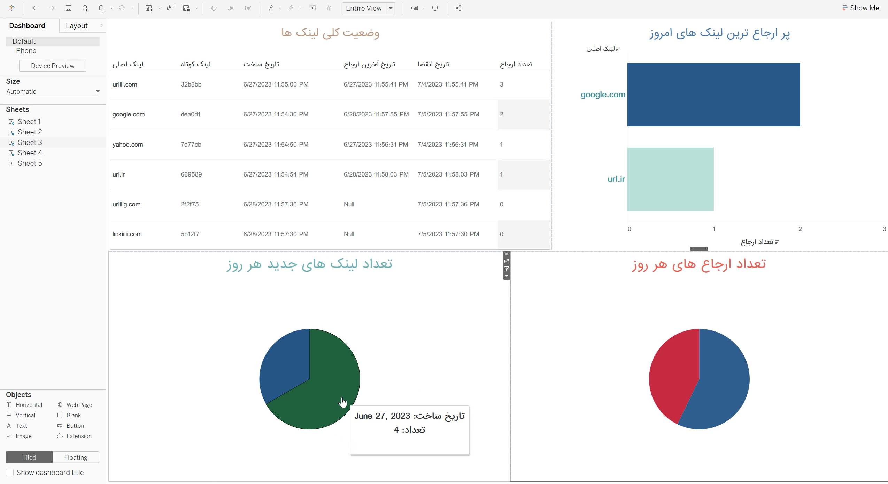

## URL Shortener
This is a URL shortener project built with Microsoft SQL Server, Python, and Tableau. It allows you to create short URLs and store them in a database. The project includes SQL stored procedures to manage the database, a Python script to interact with the database, and Tableau for visualizing the URLs stored in the database.

<br />
<p align="center">
  <a href="[https://github.com/AmirAflak/url-shortener">
    
  </a>
</p>
<br /> 

## Features
* Generate short URLs for your long URLs.
* Store URLs in a Microsoft SQL Server database.
* Automatically delete expired URLs using Job Agents.
* Interact with the database using a Python script and pyodbc.
* Visualize the URLs using Tableau.

## Installation 
1. Clone the repo
   ```sh
   git clone https://github.com/AmirAflak/url-shortener.git
   ```
2. Navigate into the project directory:
   ```sh
   cd url-shortener
   ```
3. Install the project dependencies:
   ```sh
   pip install -r requirements.txt
   ```
4. Set up the SQL database:
* Execute the SQL scripts inside `queries` directory to create the necessary table and stored procedures.
5. Run the Python script:
  ```sh
   python main.py
  ```


